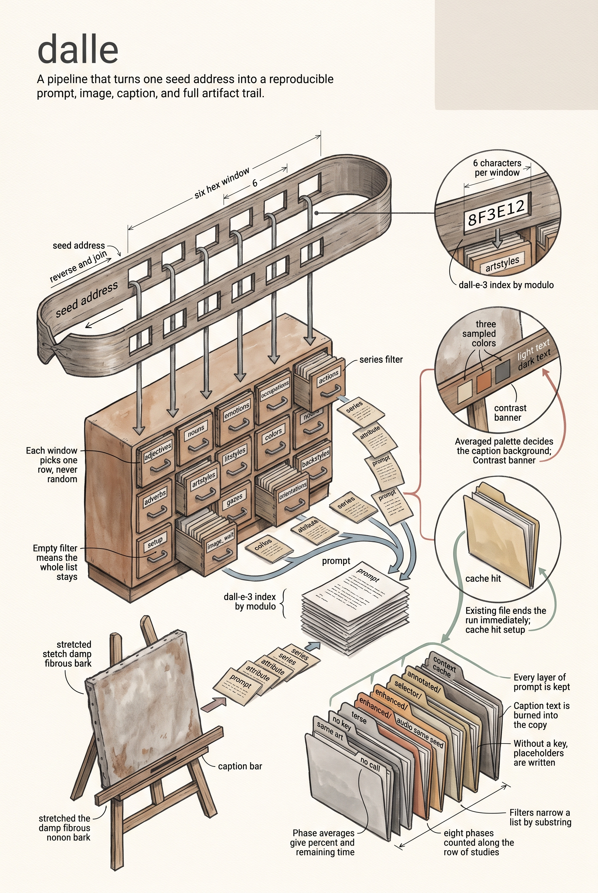

# Dalle Go Package

**Trueblocks Dalle** is a Go package for generating, enhancing, and annotating creative prompts and images, powering a Dalle application. It combines attribute-driven prompt generation, OpenAI integration, and image annotation in a modular, testable, and extensible design.

---

## 🚀 Features

- **Attribute-Driven Prompt Generation:** Compose prompts from structured attributes (adjectives, nouns, styles, etc.).
- **Template-Based Construction:** Go templates for multiple prompt formats (data, title, terse, enhanced).
- **OpenAI Integration:** Enhance prompts with GPT-4 or DALL·E 3 via API.
- **Text-to-Speech:** Optional narration of the prompt via OpenAI `tts-1`.
- **Image Annotation:** Overlay text on images with color/contrast analysis.
- **Series Management:** Organize and persist sets of attributes for reproducibility.
- **Caching:** In-memory cache for fast prompt/image retrieval, an LRU+TTL context cache, and a binary database cache.
- **Live Progress & Metrics:** Phase-based progress reporting with percent and ETA plus persisted rolling phase averages and cache-hit stats.
- **Testability:** Centralized mocks and dependency injection for robust testing.

---

## 🗂️ Project Structure

| File/Folder      | Purpose                                             |
| ---------------- | --------------------------------------------------- |
| `context.go`     | Context: templates, series, dbs, cache              |
| `manager.go`     | Context lifecycle, LRU+TTL cache, public API        |
| `series.go`      | Series struct and attribute set management          |
| `series_crud.go` | Series persistence, filtering, and management       |
| `text2speech.go` | OpenAI TTS integration and audio generation         |
| `pkg/model/`     | DalleDress struct and core types                    |
| `pkg/prompt/`    | Templates, attribute derivation, prompt enhancement |
| `pkg/image/`     | Image request, download and processing              |
| `pkg/annotate/`  | Image annotation utilities                          |
| `pkg/progress/`  | Phase tracking and metrics                          |
| `pkg/storage/`   | Data directory, embedded databases, caching         |
| `pkg/utils/`     | Utility functions                                   |
| `ai/`            | AI-related assets                                   |
| `output/`        | Output and cache files (auto-generated)             |

---

## 🛠️ Setup

### Prerequisites

- Go 1.23+
- [Core](https://github.com/TrueBlocks/trueblocks-core)
- [OpenAI API Key](https://platform.openai.com/account/api-keys)
- [gg](https://git.sr.ht/~sbinet/gg) and [go-colorful](https://github.com/lucasb-eyer/go-colorful) for image annotation

### Getting Started

```bash
git clone https://github.com/TrueBlocks/trueblocks-dalle/v6.git
cd trueblocks-dalle
go mod tidy
```

The OpenAI API key is read from the `OPENAI_API_KEY` environment variable —
inject it with `tb-exec --only OPENAI_API_KEY` rather than exporting it in your
shell profile. Without it, enhancement, image generation, and speech are
skipped (placeholders are written) instead of failing the pipeline.

Artifacts are written under the data directory, which defaults to a
platform-specific location (`~/Library/Application Support/TrueBlocks` on
macOS, `~/.local/share/TrueBlocks` on Linux, `%APPDATA%/TrueBlocks` on Windows)
and can be overridden with `TB_DALLE_DATA_DIR`.

---

## ✨ Usage

**Full Pipeline (prompt → image → annotation):**

```go
import (
	"time"

	dalle "github.com/TrueBlocks/trueblocks-dalle/v6"
)

path, err := dalle.GenerateAnnotatedImage("demo", "0x1234...", false, 5*time.Minute)
if err != nil { panic(err) }
fmt.Println("Annotated image saved to:", path)
```

**Basic Prompt Generation:**

```go
import dalle "github.com/TrueBlocks/trueblocks-dalle/v6"

ctx := dalle.NewContext()
dd, err := ctx.MakeDalleDress("0x1234...")
if err != nil { panic(err) }
fmt.Println(dd.Prompt)
```

**Enhance a Prompt:**

```go
import "github.com/TrueBlocks/trueblocks-dalle/v6/pkg/prompt"

result, err := prompt.EnhancePrompt("A cat in a hat", "author")
fmt.Println(result)
```

**Annotate an Image:**

```go
import "github.com/TrueBlocks/trueblocks-dalle/v6/pkg/annotate"

outputPath, err := annotate.Annotate("Hello World", "generated/input.png", "bottom", 0.1)
fmt.Println("Annotated image saved to:", outputPath)
```

**Narrate a Prompt:**

```go
audioPath, err := dalle.GenerateSpeech("demo", "0x1234...", 5*time.Minute)
fmt.Println("Audio saved to:", audioPath)
```

---

## 🧩 Data & Output

- **Attribute Databases:** Embedded CSVs (see `pkg/storage/databases.tar.gz`). Add new CSVs and update `pkg/prompt/attribute.go` and `DatabaseNames` if needed.
- **Output:** Prompts, images, JSON metadata, and audio are written under `<data dir>/output/<series>/`, organized by type (`data/`, `title/`, `terse/`, `prompt/`, `enhanced/`, `generated/`, `annotated/`, `selector/`, `audio/`).

---

## 🧪 Testing

Run all tests:

```bash
go test ./...
```

- Tests cover core logic, with mocks for file/network operations.
- Some image annotation tests may require macOS and system fonts.

---

## 📝 Contributing

- Open issues for bugs or features.
- Submit PRs with clear descriptions and tests.
- Follow Go best practices.

---

## 📜 License

This project is licensed under the **GNU GPL v3**. See [LICENSE](./LICENSE).

---

## 👩‍💻 Credits

- Contributors
- Thanks to [gg](https://git.sr.ht/~sbinet/gg), [go-colorful](https://github.com/lucasb-eyer/go-colorful), and [OpenAI](https://openai.com/).

---

## 💡 Tips

- Set `OPENAI_API_KEY`; optionally set `TB_DALLE_DATA_DIR`, `TB_DALLE_NO_ENHANCE=1` (skip enhancement), and `TB_DALLE_ARCHIVE_RUNS=1` (archive per-run snapshots).
- Progress JSON is always available during generation; poll the server endpoint returning the embedded DalleDress and phase timings, or call `GetProgress` / `ActiveProgressReports` directly.
- Extend attributes by adding CSVs and updating `pkg/prompt/attribute.go`.
- Use Go’s testing/logging for debugging.
- Caching is built-in; tune context cache size/TTL with `ConfigureManager` as needed.

---

## 🌈 Why Use Dalle Go Package?

- **Modular:** Swap templates, attributes, or models easily.
- **Transparent:** Open, testable, and well-documented.
- **Creative:** Designed for generative art and prompt engineering.

---

## 📬 Questions?

Open an issue or reach out on GitHub. Happy prompting!

---

## 📊 Progress Reporting & Metrics

The generation pipeline emits a canonical set of phases:

`setup → base_prompts → enhance_prompt → image_prep → image_wait → image_download → annotate → completed`

A run that errors ends its current phase and transitions to `failed` instead of `completed`.

Every request produces a JSON progress snapshot containing:

```
{
	"series": "simple",
	"address": "0x...",
	"currentPhase": "image_wait",
	"startedNs": 1730000000000000000,
	"percent": 37.2,
	"etaSeconds": 12.4,
	"done": false,
	"error": "",
	"cacheHit": false,
	"phases": [
		{"name":"setup","startedNs":...,"endedNs":...,"skipped":false,"error":""},
		...
	],
	"dalleDress": { /* always-present extended object; no omitempty fields */ },
	"phaseAverages": { "image_wait": 2500000000, ... }
}
```

Key points:

- Fields are never omitted or null; empty slices are `[]`.
- `percent` & `etaSeconds` derive from an EMA of prior completed phase durations (alpha=0.2). A phase with no prior average contributes 0 to total; percent remains 0 until at least one average exists.
- Cache hits short‑circuit: a minimal run is marked `cacheHit=true` and does not update EMAs or `generationRuns`.
- Metrics persist to `metrics/progress_phase_stats.json` (schema version `v1`). Example:

```
{
	"version": "v1",
	"phaseAverages": { "image_wait": {"count": 4, "avgNs": 2100000000} },
	"generationRuns": 12,
	"cacheHits": 5
}
```

- With `TB_DALLE_ARCHIVE_RUNS=1`, per-run snapshots are serialized under `metrics/runs/`.

Testing helpers: `ResetMetricsForTest()`, `ForceMetricsSave()`, `GetProgress(series,address)`.

Cache hit behavior: if an annotated image already exists when a request arrives, a completed progress snapshot is synthesized (if no active run) and metrics file updated with an incremented `cacheHits` counter only.

Concurrency: a single `ProgressManager` serializes per-(series,address) updates; the same `DalleDress` pointer is reused (treat as read‑only outside the manager). A per-(series,address) request lock with TTL prevents duplicate concurrent generations.

ETA visibility: `etaSeconds` is 0 until sufficient historical averages exist to compute remaining time; elapsed time in the current phase is capped at its average to limit over-estimation.

---


