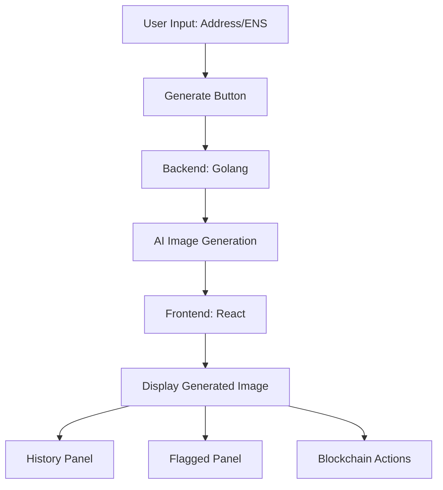
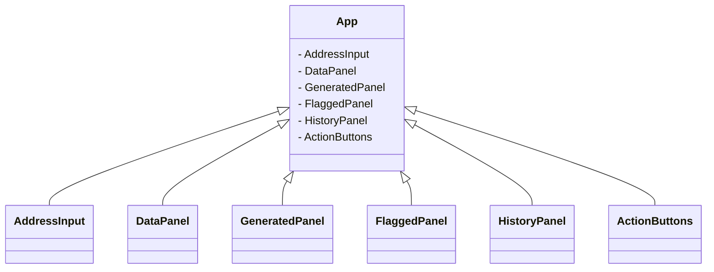
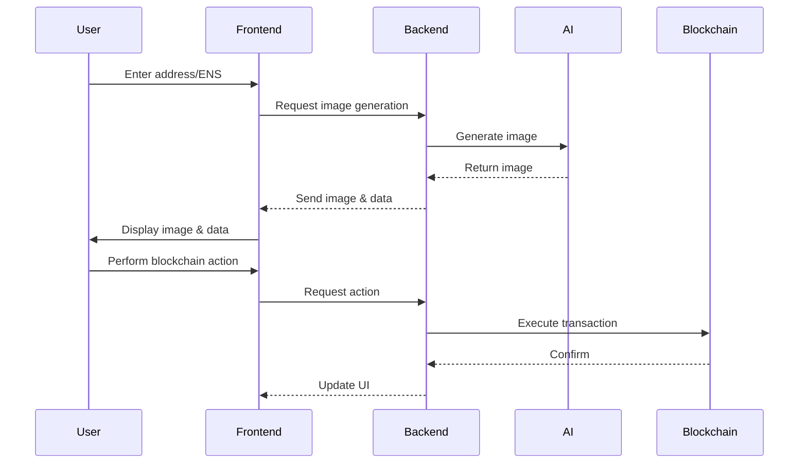
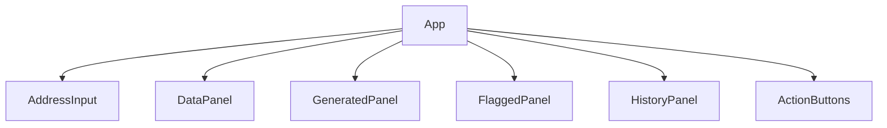
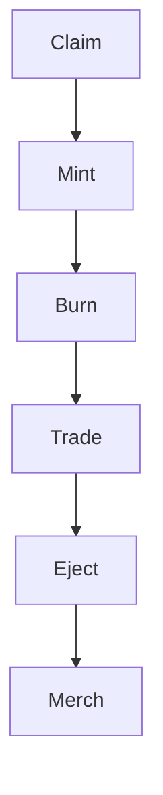

# DalleDress Single Page App Specification

## Overview
The DalleDress Single Page App (SPA) is a desktop application built with Wails, React, TypeScript, Mantine, and TrueBlocks. It provides a user interface for generating, viewing, and managing AI-generated images based on blockchain addresses or ENS names. The backend is implemented in Golang for performance and concurrency, while the frontend leverages modern React patterns and Mantine UI components.

## Features
- Address/ENS input for image generation
- AI image generation and regeneration
- Data panel showing prompt attributes
- Generated image preview with prompt details
- History of generated images
- Flagged images section
- Blockchain actions: Connect, Claim, Mint, Burn, Trade, Eject, Merch

## UI Components
- **Input Bar**: For entering an address or ENS
- **Generate/Regenerate Buttons**: Triggers image generation
- **Connect Button**: Connects to wallet or blockchain
- **Data Panel**: Displays JSON attributes for prompt
- **Generated Panel**: Shows generated image and prompt
- **Flagged Panel**: For flagged images
- **History Panel**: Thumbnails of previous generations
- **Action Buttons**: Claim, Mint, Burn, Trade, Eject, Merch

## Data Flow

## Backend Integration
- **Golang Backend**: Handles requests from frontend, manages image generation, interacts with TrueBlocks SDK and Unchained Index.
- **API Endpoints**: Exposed for frontend to trigger image generation, fetch history, and perform blockchain actions.

## Smart Contract Interactions
- **Claim/Mint/Burn/Trade/Eject**: Each action interacts with smart contracts via the backend, updating the blockchain state and reflecting changes in the UI.

## State Management
- **React Context/Redux**: Used for managing global state (user address, generated images, history, flagged images, connection status).

## Component Hierarchy

## User Actions
- Enter address/ENS
- Generate/regenerate image
- View data and generated image
- Flag inappropriate images
- View history
- Perform blockchain actions

## Error Handling
- Invalid address/ENS input
- Image generation failures
- Blockchain transaction errors
- UI feedback for all errors

## Security
- Wallet connection security
- Data validation and sanitization
- Secure smart contract interactions

## Extensibility
- Modular React components
- API-driven backend
- Easy integration of new blockchain actions or image generation models

## References
- [trueblocks-dalledress](https://github.com/TrueBlocks/trueblocks-dalledress)
- [create-local-app](https://github.com/TrueBlocks/create-local-app)

---

## Mermaid Diagrams
### Data Flow

### Component Hierarchy

### Smart Contract Actions

---

This specification is based on the provided UI screenshot, the codebase structure, and the referenced repositories. For further details, see the README and source code in the linked repositories.
