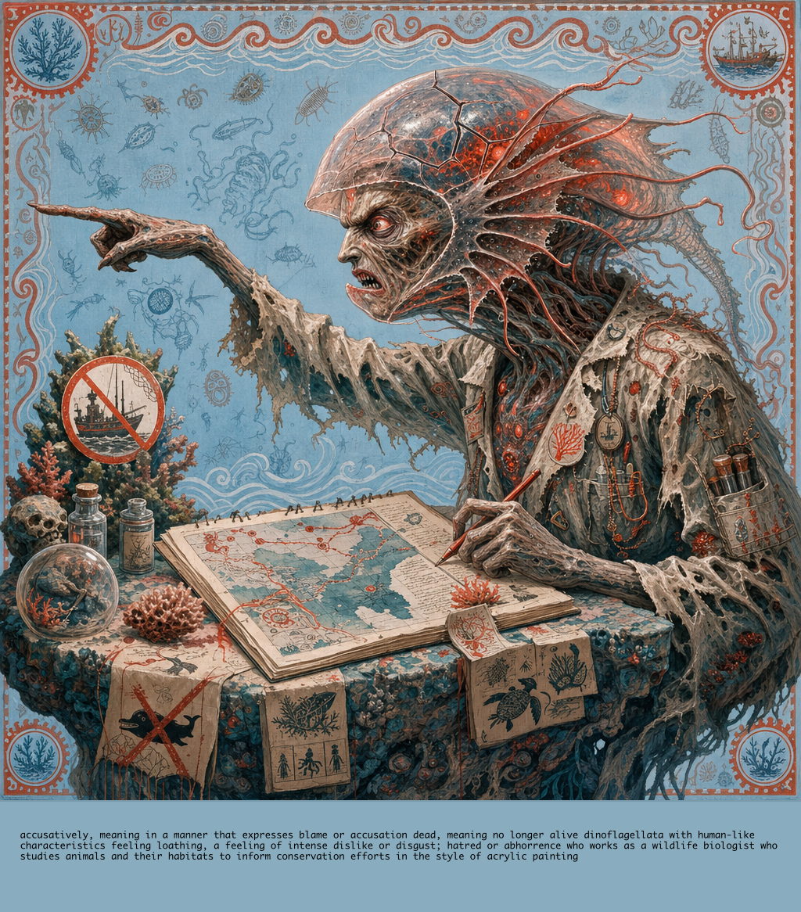
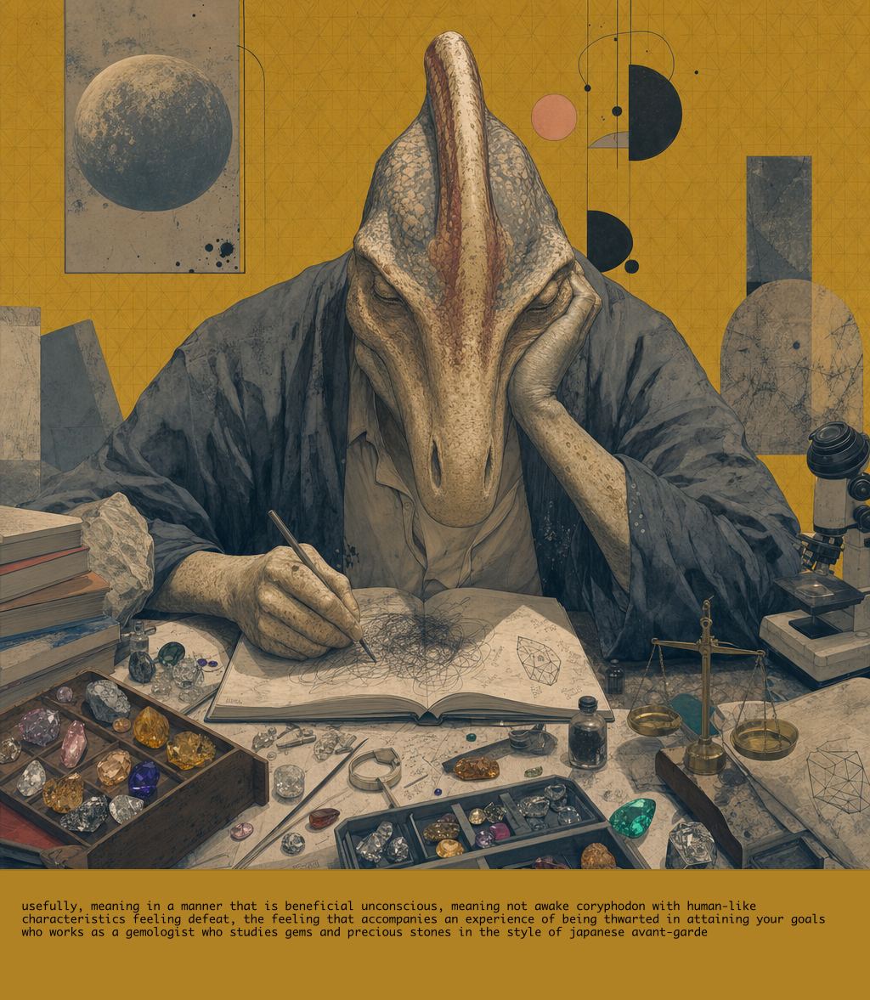
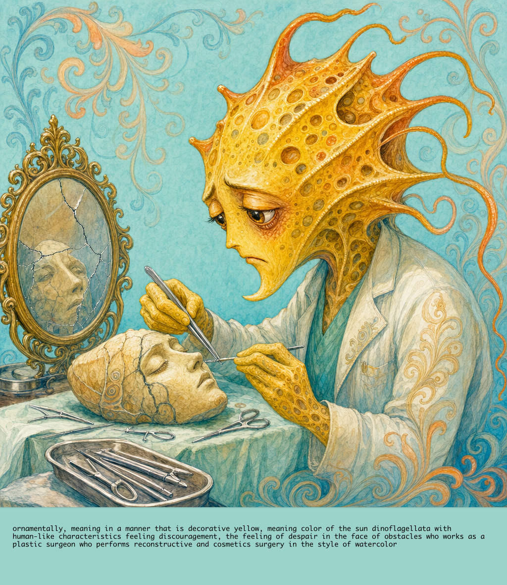
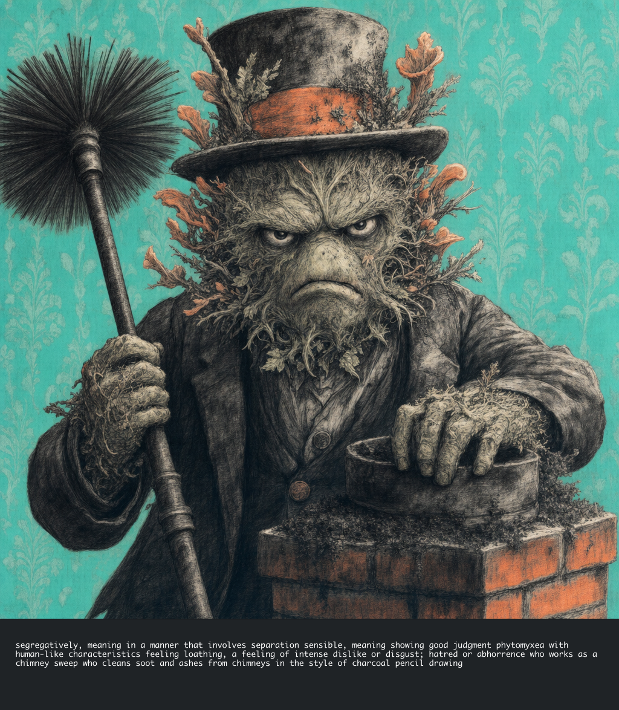
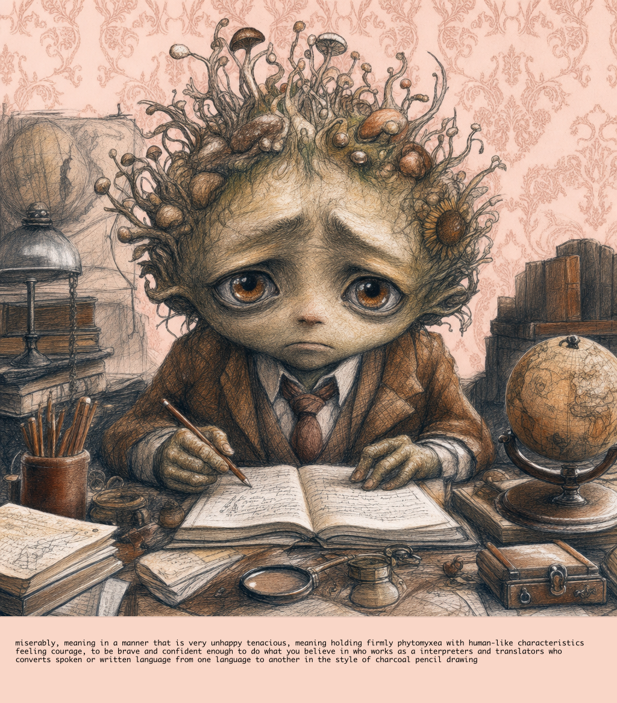

# Dalle Prompt-Image Alignment Scoring Sheet

**Generated:** from `/Users/jrush/.local/share/trueblocks/dalle/archives`.
**Instructions:** For each image, score 1–5 on each rubric item. Total = 5–25.

---

## dead dinoflagellata biologist
**Series:** `five-tone-postal-protozoa`  
**ID:** `02b62e935f63828bfcba3a32053df9306f30f268d15d8656618a3d6b50bcd5d4`  
**Input:** *Show me how to funk it up.*



### Prompt-Level Attribute Checklist

| Attribute | Present | Value |
|---|---|---|
| adverb | ✅ | accusatively |
| adjective | ✅ | dead |
| noun | ✅ | dinoflagellata |
| emotion | ✅ | loathing |
| occupation | ✅ | wildlife biologist |
| action | ✅ | devising |
| artStyle1 | ✅ | acrylic painting |
| artStyle2 | ✅ | watercolor |
| litStyle | ✅ | folklore |
| color1 | ✅ | tomato |
| color2 | ✅ | rosybrown |
| color3 | ✅ | lightsteelblue |
| viewpoint | ❌ | Dutch angle |
| gaze | ✅ | to the left |
| composition | ❌ | asymmetrical |
| place | ❌ | st. catherine's monastery |
| trope | ❌ | voyage and return |
| **Total** | **13/17** | |

### Prompts

**Basic:**
```
Draw a accusatively, meaning in a manner that expresses blame or accusation dead, meaning no longer alive dinoflagellata with human-like
characteristics feeling loathing, a feeling of intense dislike or disgust; hatred or abhorrence who works as a wildlife biologist who studies animals and their habitats to inform conservation efforts.

Noun: dinoflagellata with human-like characteristics.
Emotion: loathing, a feeling of intense dislike or disgust; hatred or abhorrence.
Occupation:  who works as a wildlife biologist who studies animals and their habitats to inform conservation efforts.
Action: devising, meaning planning or inventing.
A bold fusion of acrylic painting, which uses fast drying synthetic paints for vibrant and durable artworks and watercolor, which involves painting with pigments suspended in a water-based solution, led by acrylic painting, which uses fast drying synthetic paints for vibrant and durable artworks.
Literary Style: folklore, which preserves traditional stories and legends passed down through generations.
The primary color scheme should emphasize #ff6347 and #bc8f8f, but use the full range of colors the artistic style demands.
Orient the scene  and make sure the dinoflagellata is facing to the left.
Compose the scene using  and ensure the dinoflagellata follows this visual structure.
The background should be this color #b0c4de and patterned.

Emphasize the emotional aspect of the image. Look deeply into and expand upon the
many connotative meanings of "dinoflagellata," "loathing," "dead",
and "accusatively." Find the representation that most closely matches all the data.

Focus on the emotion, the noun, and the styles.
```

**Enhanced:**
```
**Enhanced art generation prompt:**

Create a vivid folklore-inspired image of a **dead anthropomorphic Dinoflagellata**, facing **left**, portrayed **accusatively** as though it has risen from some cursed tidepool to lay blame upon the living. Its tiny planktonic body should bear human-like traits: a gaunt scholar’s face, hollow furious eyes, withered hands, and torn field-biologist garments marked by notebooks, sample vials, maps, and conservation tags. Though no longer alive, it seems animated by old hatred—its translucent shell cracked like an ancient relic, its flagella limp yet twitching like ghostly whips, its faint bioluminescence burning with **loathing**, disgust, and abhorrence.

Show the creature **devising** a bitter conservation plan: hunched over a weather-stained research table or coral-stone altar, sketching habitats, animal migration routes, and desperate preservation strategies while pointing accusingly to the left, as if condemning poachers, polluters, or careless kings from an old village legend. The mood should be angry and mournful, steeped in the feeling of a folktale where nature’s smallest spirit returns from death to accuse humanity.

Use a **bold fusion of acrylic painting and watercolor**, with **acrylic painting leading the style**: strong, durable, vibrant strokes layered over watery bleeding textures. Emphasize the primary color scheme of **#ff6347** and **#bc8f8f**, using them in the corpse-glow, angry markings, scientific notes, and mythic ornamentation, while allowing the full palette required by the scene. The background should be **#b0c4de**, patterned with folkloric wave motifs, microscopic plankton forms, old conservation symbols, and repeating tale-like borders.

Composition should feel like an old warning illustration passed down through generations: dramatic, accusatory, and symbolic. The dead dinoflagellata must remain the emotional center, its left-facing posture, hateful expression, and act of devising making clear the intertwined meanings of **death, blame, loathing, biology, and ancient ecological vengeance**.
```

### Image-Level Rubric

| Criterion | Score (1–5) | Notes |
|---|---|---|
| Subject (creature + occupation props) | | |
| Emotion | | |
| Style (art style + colors) | | |
| Setting (place/trope) | | |
| Technical (viewpoint/composition/gaze) | | |
| **Total** | **/25** | |

---

## unconscious coryphodon gemologist
**Series:** `empty`  
**ID:** `e18ce5143adc3581502cbb7c70988de13c61c16948ba57f83cf0ddc07f6fd5e5`  
**Input:** *Wimp*



### Prompt-Level Attribute Checklist

| Attribute | Present | Value |
|---|---|---|
| adverb | ✅ | usefully |
| adjective | ✅ | unconscious |
| noun | ✅ | coryphodon |
| emotion | ✅ | defeat |
| occupation | ✅ | gemologist |
| action | ✅ | scribbling |
| artStyle1 | ✅ | japanese avant-garde |
| artStyle2 | ✅ | mono-ha |
| litStyle | ✅ | detective novel |
| color1 | ✅ | peachpuff |
| color2 | ✅ | dimgray |
| color3 | ✅ | goldenrod |
| viewpoint | ❌ | overhead |
| gaze | ✅ | into the camera |
| composition | ❌ | unbalanced |
| place | ❌ | st. catherine's monastery |
| trope | ❌ | rebirth |
| **Total** | **13/17** | |

### Prompts

**Basic:**
```
Draw a usefully, meaning in a manner that is beneficial unconscious, meaning not awake coryphodon with human-like
characteristics feeling defeat, the feeling that accompanies an experience of being thwarted in attaining your goals who works as a gemologist who studies gems and precious stones.

Noun: coryphodon with human-like characteristics.
Emotion: defeat, the feeling that accompanies an experience of being thwarted in attaining your goals.
Occupation:  who works as a gemologist who studies gems and precious stones.
Action: scribbling, meaning writing carelessly.
In the style of japanese avant-garde, which features innovative and experimental works pushing the boundaries of traditional art forms, lightly influenced by mono-ha, which is a Japanese art movement that emphasizes the materiality and physical presence of objects.
Literary Style: detective novel, which follows a detective as they solve crimes and mysteries.
The primary color scheme should emphasize #ffdab9 and #696969, but use the full range of colors the artistic style demands.
Orient the scene  and make sure the coryphodon is facing into the camera.
Compose the scene using  and ensure the coryphodon follows this visual structure.
The background should be this color #daa520 and patterned.

Emphasize the emotional aspect of the image. Look deeply into and expand upon the
many connotative meanings of "coryphodon," "defeat," "unconscious",
and "usefully." Find the representation that most closely matches all the data.

Focus on the emotion, the noun, and the styles.
```

**Enhanced:**
```
N/A
```

### Image-Level Rubric

| Criterion | Score (1–5) | Notes |
|---|---|---|
| Subject (creature + occupation props) | | |
| Emotion | | |
| Style (art style + colors) | | |
| Setting (place/trope) | | |
| Technical (viewpoint/composition/gaze) | | |
| **Total** | **/25** | |

---

## yellow dinoflagellata surgeon
**Series:** `five-tone-postal-protozoa`  
**ID:** `8cabfc4a4c1c317db14a32e2e5036a9fb4d33486b509c90e3825f8425725b802`  
**Input:** *When I find myself in times of trouble.*



### Prompt-Level Attribute Checklist

| Attribute | Present | Value |
|---|---|---|
| adverb | ✅ | ornamentally |
| adjective | ✅ | yellow |
| noun | ✅ | dinoflagellata |
| emotion | ✅ | discouragement |
| occupation | ✅ | plastic surgeon |
| action | ✅ | curing |
| artStyle1 | ✅ | watercolor |
| artStyle2 | ✅ | color pencil drawing |
| litStyle | ✅ | narrative nonfiction |
| color1 | ✅ | darkorange |
| color2 | ✅ | orangered |
| color3 | ✅ | powderblue |
| viewpoint | ❌ | overhead |
| gaze | ✅ | to the left |
| composition | ❌ | asymmetrical |
| place | ❌ | providence canyon state park |
| trope | ❌ | rags to riches |
| **Total** | **13/17** | |

### Prompts

**Basic:**
```
Draw a ornamentally, meaning in a manner that is decorative yellow, meaning color of the sun dinoflagellata with human-like
characteristics feeling discouragement, the feeling of despair in the face of obstacles who works as a plastic surgeon who performs reconstructive and cosmetics surgery.

Noun: dinoflagellata with human-like characteristics.
Emotion: discouragement, the feeling of despair in the face of obstacles.
Occupation:  who works as a plastic surgeon who performs reconstructive and cosmetics surgery.
Action: curing, meaning restoring to health.
In the style of watercolor, which involves painting with pigments suspended in a water-based solution with subtle echoes of color pencil drawing, which involves using colored pencils to create detailed and vibrant artwork.
Literary Style: narrative nonfiction, which tells factual stories using literary styles and techniques.
The primary color scheme should emphasize #ff8c00 and #ff4500, but use the full range of colors the artistic style demands.
Orient the scene  and make sure the dinoflagellata is facing to the left.
Compose the scene using  and ensure the dinoflagellata follows this visual structure.
The background should be this color #b0e0e6 and patterned.

Emphasize the emotional aspect of the image. Look deeply into and expand upon the
many connotative meanings of "dinoflagellata," "discouragement," "yellow",
and "ornamentally." Find the representation that most closely matches all the data.

Focus on the emotion, the noun, and the styles.
```

**Enhanced:**
```
N/A
```

### Image-Level Rubric

| Criterion | Score (1–5) | Notes |
|---|---|---|
| Subject (creature + occupation props) | | |
| Emotion | | |
| Style (art style + colors) | | |
| Setting (place/trope) | | |
| Technical (viewpoint/composition/gaze) | | |
| **Total** | **/25** | |

---

## sensible phytomyxea chimney sweep
**Series:** `five-tone-postal-protozoa`  
**ID:** `b193c3dc843783891d51e1d8501a446b42961d5d5e82f41835ca8032e32d5fb3`  
**Input:** *Sow do I make the thing funky?*



### Prompt-Level Attribute Checklist

| Attribute | Present | Value |
|---|---|---|
| adverb | ✅ | segregatively |
| adjective | ✅ | sensible |
| noun | ✅ | phytomyxea |
| emotion | ✅ | loathing |
| occupation | ✅ | chimney sweep |
| action | ✅ | taming |
| artStyle1 | ✅ | charcoal pencil drawing |
| artStyle2 | ✅ | charcoal pencil drawing |
| litStyle | ✅ | dirge |
| color1 | ✅ | coral |
| color2 | ✅ | honeydew |
| color3 | ✅ | turquoise |
| viewpoint | ❌ | side view |
| gaze | ✅ | into the camera |
| composition | ❌ | negative space |
| place | ❌ | hersheypark |
| trope | ❌ | the hero's journey |
| **Total** | **13/17** | |

### Prompts

**Basic:**
```
Draw a segregatively, meaning in a manner that involves separation sensible, meaning showing good judgment phytomyxea with human-like
characteristics feeling loathing, a feeling of intense dislike or disgust; hatred or abhorrence who works as a chimney sweep who cleans soot and ashes from chimneys.

Noun: phytomyxea with human-like characteristics.
Emotion: loathing, a feeling of intense dislike or disgust; hatred or abhorrence.
Occupation:  who works as a chimney sweep who cleans soot and ashes from chimneys.
Action: taming, meaning making less wild.
In the style of charcoal pencil drawing, which involves using charcoal sticks or pencils to create detailed monochromatic artwork.
Literary Style: dirge, which expresses mourning or grief through somber song or lamentation.
The primary color scheme should emphasize #ff7f50 and #f0fff0, but use the full range of colors the artistic style demands.
Orient the scene  and make sure the phytomyxea is facing into the camera.
Compose the scene using  and ensure the phytomyxea follows this visual structure.
The background should be this color #40e0d0 and patterned.

Emphasize the emotional aspect of the image. Look deeply into and expand upon the
many connotative meanings of "phytomyxea," "loathing," "sensible",
and "segregatively." Find the representation that most closely matches all the data.

Focus on the emotion, the noun, and the styles.
```

**Enhanced:**
```
N/A
```

### Image-Level Rubric

| Criterion | Score (1–5) | Notes |
|---|---|---|
| Subject (creature + occupation props) | | |
| Emotion | | |
| Style (art style + colors) | | |
| Setting (place/trope) | | |
| Technical (viewpoint/composition/gaze) | | |
| **Total** | **/25** | |

---

## tenacious phytomyxea translator
**Series:** `five-tone-postal-protozoa`  
**ID:** `794bda6b8ae529bf696ea03e4aa78525b06cd411544ca660d529835d15aa9cbb`  
**Input:** *How do I make the thing funky?*



### Prompt-Level Attribute Checklist

| Attribute | Present | Value |
|---|---|---|
| adverb | ✅ | miserably |
| adjective | ✅ | tenacious |
| noun | ✅ | phytomyxea |
| emotion | ✅ | courage |
| occupation | ✅ | interpreters and translators |
| action | ✅ | producing |
| artStyle1 | ✅ | charcoal pencil drawing |
| artStyle2 | ✅ | color pencil drawing |
| litStyle | ✅ | mystery |
| color1 | ✅ | saddlebrown |
| color2 | ✅ | ghostwhite |
| color3 | ✅ | mistyrose |
| viewpoint | ❌ | isometric |
| gaze | ✅ | into the camera |
| composition | ❌ | rule of thirds |
| place | ❌ | nantucket |
| trope | ❌ | the trickster |
| **Total** | **13/17** | |

### Prompts

**Basic:**
```
Draw a miserably, meaning in a manner that is very unhappy tenacious, meaning holding firmly phytomyxea with human-like
characteristics feeling courage, to be brave and confident enough to do what you believe in who works as a interpreters and translators who converts spoken or written language from one language to another.

Noun: phytomyxea with human-like characteristics.
Emotion: courage, to be brave and confident enough to do what you believe in.
Occupation:  who works as a interpreters and translators who converts spoken or written language from one language to another.
Action: producing, meaning making something.
In the style of charcoal pencil drawing, which involves using charcoal sticks or pencils to create detailed monochromatic artwork, lightly influenced by color pencil drawing, which involves using colored pencils to create detailed and vibrant artwork.
Literary Style: mystery, which involves solving a crime or uncovering secrets often with suspense.
The primary color scheme should emphasize #8b4513 and #f8f8ff, but use the full range of colors the artistic style demands.
Orient the scene  and make sure the phytomyxea is facing into the camera.
Compose the scene using  and ensure the phytomyxea follows this visual structure.
The background should be this color #ffe4e1 and patterned.

Emphasize the emotional aspect of the image. Look deeply into and expand upon the
many connotative meanings of "phytomyxea," "courage," "tenacious",
and "miserably." Find the representation that most closely matches all the data.

Focus on the emotion, the noun, and the styles.
```

**Enhanced:**
```
N/A
```

### Image-Level Rubric

| Criterion | Score (1–5) | Notes |
|---|---|---|
| Subject (creature + occupation props) | | |
| Emotion | | |
| Style (art style + colors) | | |
| Setting (place/trope) | | |
| Technical (viewpoint/composition/gaze) | | |
| **Total** | **/25** | |

---
