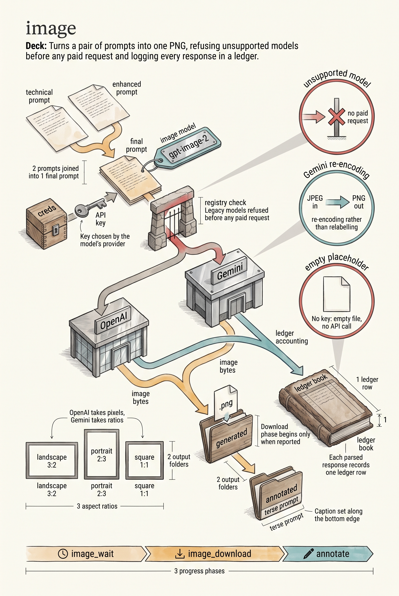

# Image generation

The dalle image workflow uses packages/ai's DallE.GenerateImageResult for OpenAI
API requests, retries, errors, response decoding, and downloading bytes, and
packages/ai's Gemini.GenerateImage for Gemini image models. This package keeps
prompt construction, per-tool image settings, file paths, annotation, and
progress updates. RequestImage and RequestImageWithOptions retain their signatures.
ImageOptions.Context optionally supplies cancellation.

The default remains gpt-image-2. Canonical OpenAI or Gemini image models in the
shared registry are accepted; unsupported legacy models fail explicitly before a
paid request. Currently dall-e-2, dall-e-3, gpt-image-1.5, gpt-image-1-mini, and dated
variants without their own registry entries are unsupported. A substring match
to a different model is insufficient for accurate pricing. No model substitution
or private pricing table is used. The API key is looked up through creds using
the key name for the image model's provider.

Existing model-specific size/quality and final prompt rules remain, including the
extra visual directive for gpt-image-1. Gemini models receive an aspect ratio
(3:2, 2:3, or 1:1) instead of a pixel size, plus the registry's image resolution.
Full ImageURL overrides pass to the shared OpenAI client, and request IDs pass
with the image options. URL data retains precedence when a response includes
both URL and base64. The generation deadline uses ImageTimeout; a non-positive
ImageTimeout fails before any request. URL downloads retain the previous absence
of a separate timeout, while honoring a supplied parent context. The default
library single attempt avoids introducing retries.

The shared response callback stores ImageURL and DownloadMode before downloading,
and transitions image_wait to image_download when a download mode is reported.
Generated bytes are written to the existing .png path; JPEG data (such as
Gemini's) is re-encoded to PNG rather than stored mislabeled. Writing is followed
by optional annotation and the existing metadata updates. When TB_CMD_LINE is
true, the annotated image is opened locally, and a failure to open is logged only.
Missing credentials still create an empty placeholder in generated or annotated,
according to the annotation option, without calling the API.

Each parsed successful API response records one image ledger row through
ai.RecordImageCall, using AiConfiguration.Tool or the executable basename.
Reported usage is per-call. For OpenAI, LastUsage is never read; for Gemini, a
row is recorded from the client's LastUsage whenever it is reported, even if
generation then returns an error. Missing usage produces blank
image token and cost fields, while explicitly reported zero produces numeric
zero. An API response remains accounted for if decoding, downloading, writing,
or annotation subsequently fails. Provider failures and credential bypasses do
not create ledger rows. Ledger failures are logged without discarding an image.

Tests inject the shared HTTP transport, use temporary output/ledger folders, and
exercise real file writes without paid API calls. Build configuration is unchanged.

