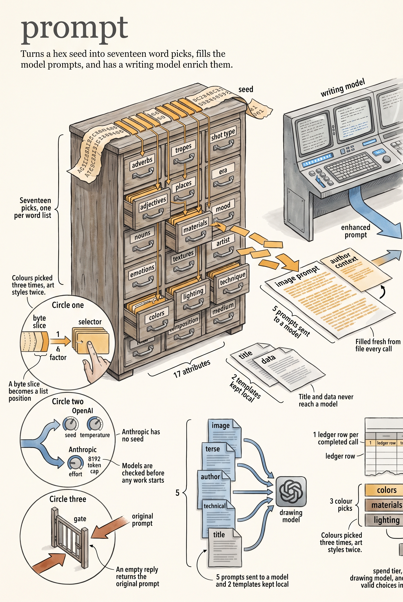

# pkg/prompt

This package builds prompts and supplies the enhancement behavior for the project.
Prompt and literary enhancement call the shared provider clients in packages/ai,
OpenAI or Anthropic according to the enhancement model's company. HTTP requests,
retries, response decoding, model pricing, and the usage ledger come from that
library.

- Prompt templates and generation
- Attribute handling
- Shared OpenAI and Anthropic client adapters

The five prompts dalle sends to a model — image, terse, author, technical, and
the literary enhance instruction — are served from files through the shared
cooking package. Each is registered under its repo-relative source path
(dalle/pkg/prompt/prompts/*.md), stamped to the mirror, and filled fresh from it
on every call. The data and title templates stay in Go: neither is sent to a
model, so both remain plain text/template values.

Both enhancement paths retain author/system context, the original user prompt,
configured model ID (including dated variants), and the configured deadline.
On OpenAI models they also keep full endpoint overrides, and seed and temperature
values of zero remain omitted. Literary enhancement additionally omits temperature
for gpt-5 models and appends the enhance instruction, filled from the registry, to
the system context. Anthropic models have no seed. They run at the configured
enhancement effort (AiConfiguration.EnhancementEffort) with an 8192-token limit.
The OpenAI path adds no token limit. Neither path adds an additional retry loop;
the shared client's default single attempt preserves existing behavior.

TB_DALLE_NO_ENHANCE=1, missing credentials for the enhancement model's provider,
or empty author context bypass the API and accounting. Empty choices or content
return the original prompt. Provider errors retain the legacy OpenAIAPIError
wrapper, code, HTTP status, and request ID; errors.As can also recover the shared
ai.APIError through it. Cancellation and deadline errors remain accessible with
errors.Is.

The enhancement model must resolve through ai.LookupModel to a writing model
from OpenAI or Anthropic. By default the models come from the shared registry's
role table at TB_DALLE_SPEND (pro by default, recorded in AiConfiguration.Spend).
The compose row, at its effort, enhances prompts, and the image row supplies the
image model. TB_DALLE_ENHANCEMENT_MODEL and TB_DALLE_IMAGE_MODEL name either model
outright; gpt-5.5 and gpt-image-2 restore the OpenAI path. An unknown tier leaves
the model empty, which the first call refuses by name. Registered dated variants
are sent unchanged. Unregistered legacy models (including gpt-4-turbo,
gpt-3.5-turbo, and gpt-5 without a matching registry entry), image models, and
other providers now fail explicitly before an API call. These errors name the
spend tier, and no replacement model or guessed pricing is used.

AiConfiguration.ProviderKeys lists the credentials the configured models need,
without repeats: the enhancement model's provider key first, then the image
model's. A model missing from the registry is an error, so a server can refuse to
start instead of failing on its first request. AiConfiguration.CheckModels confirms
before any work starts that the enhancement model is an OpenAI or Anthropic writing
model. It also confirms that the image model is an OpenAI or Gemini drawing model.
Each model must be named by its registry ID. When a model fails, the error lists
the valid choices.

Every completed call with reported usage records one shared ledger row, even
when empty content causes a fallback; Anthropic calls always report usage.
Missing usage, bypasses, and failed calls produce no invented token counts.
AiConfiguration.Tool can identify an embedding tool; otherwise the executable
basename identifies it (for example dalleserver or dalledress).
AiConfiguration.RequestID forwards caller correlation. A ledger write failure is
logged and does not discard a successful enhancement.

Image generation and the server's separate enhancement client are subsequent
migrations. No build configuration changes are required by this change.

